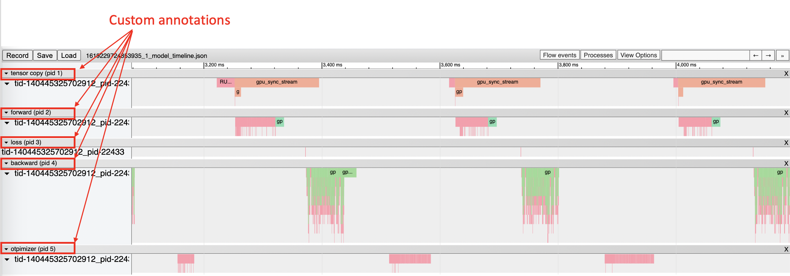

# cupti-tracer

#### Install dependencies
```
sudo yum install perf
sudo apt-get install python3-dev
sudo apt-get install libunwind-dev
```
#### Compile
```
nvcc -c --ptxas-options=-v --compiler-options '-fPIC'  -I./include/ -I../../../../include -I../../include -I/usr/include/python3.6/ smprofiler.cpp
nvcc -c --ptxas-options=-v --compiler-options '-fPIC'  -I./include/ -I../../../../include -I../../include -I/usr/include/python3.6/ smprofiler_timeline.cpp
nvcc -c --ptxas-options=-v --compiler-options '-fPIC'  -I./include/ -I../../../../include -I../../include -I/usr/include/python3.6/ perf_collector.cpp
nvcc -shared smprofiler.o smprofiler_timeline.o perf_collector.o -L /usr/lib/x86_64-linux-gnu/ -lunwind -L ../../lib64  -lcuda -L ../../../../lib64 -lcupti -I../../../../include -I../../include -I/usr/include/python3.6/ -o smprofiler.so
```

#### Run the training with smprofiler

To run the tool, just import the python module into your training script and start the profiler.
``` python
import smprofiler

smprofiler.start("forward")
outputs = net(inputs)
smprofiler.stop()

```
For an example check out 

#### Inspect results
The tracing tool will generate an output json file that you can import into Chrome trace viewer to generate a timeline view. Each row in the timeline will correspond to the custom annotation which were specified in the training script.


